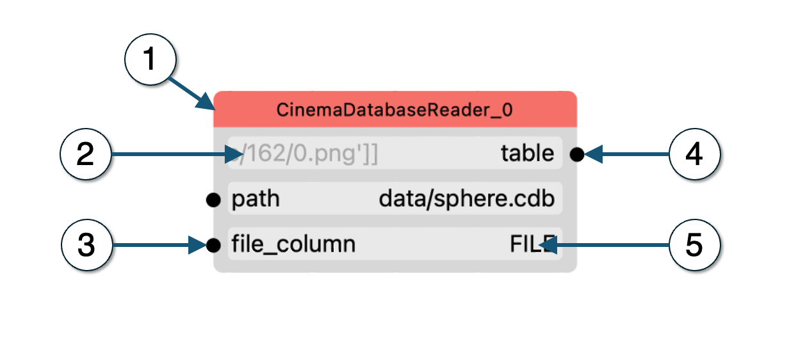
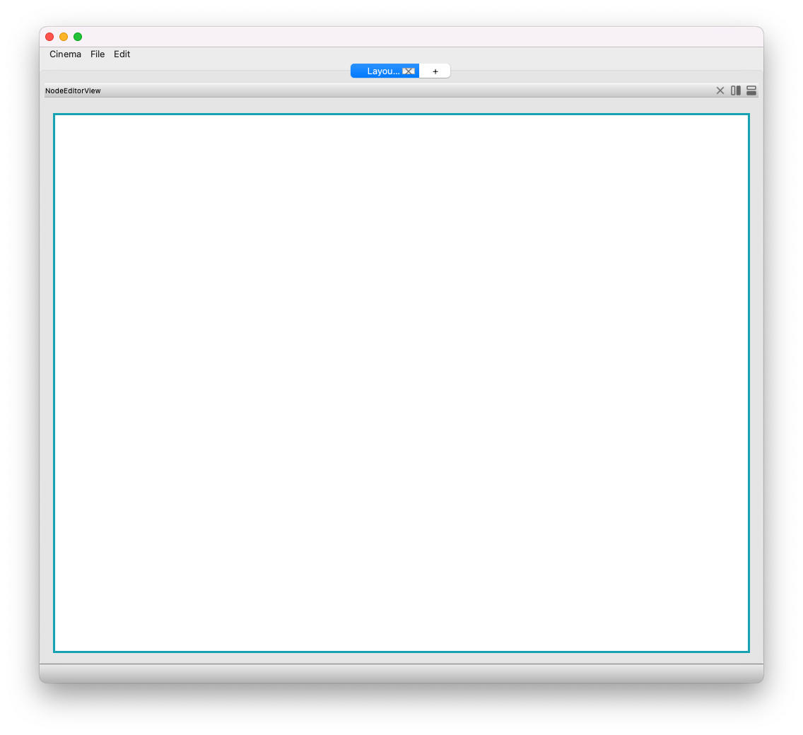
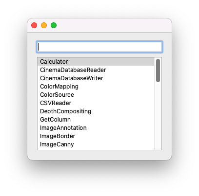
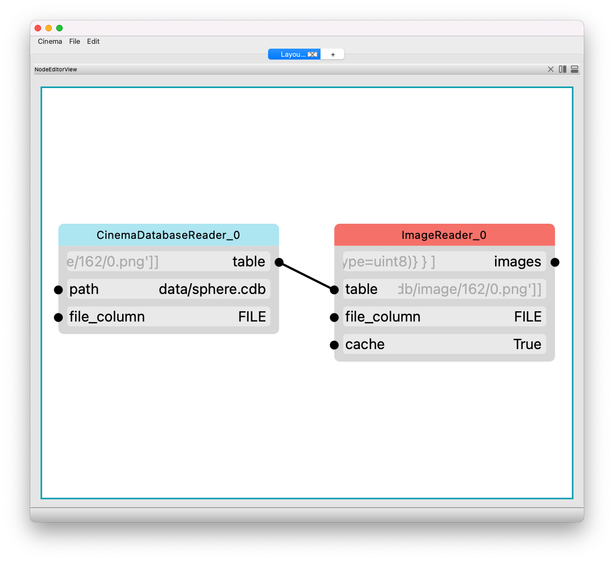
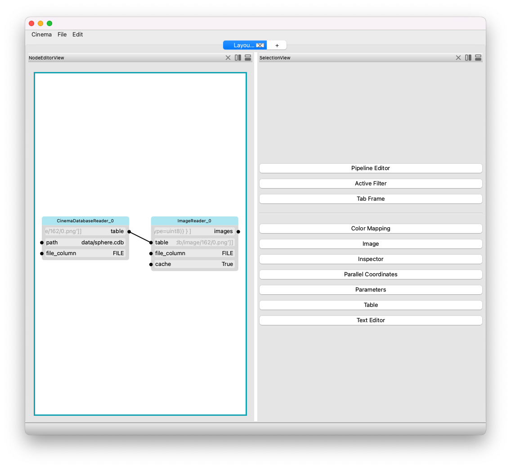
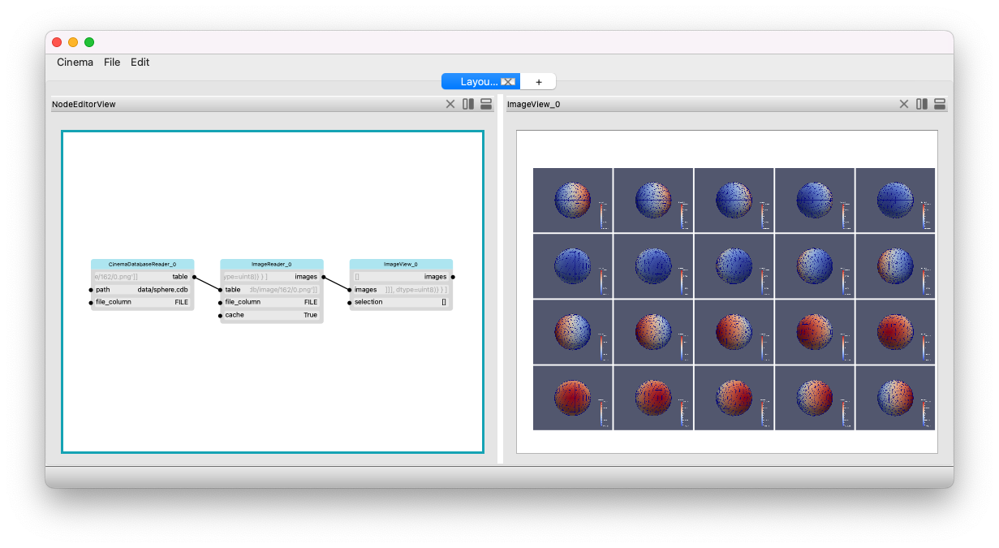

Building a Filter Graph
=======================

.. _building:

Building
--------

One of the most powerful capabilities of `pycinema` is support for building new filter graphs, specific to a task. It's easy to 
connect filters together, adjust views, and create visual layouts of information that help you look at complex data.

Components of a single filter UI
--------------------------------

Each filter will have places that can accept input (like a text box), and dots showing places that can be connected (either inputs or outputs. In this example, we see the inputs and outputs of a *CinemaDatabaseReader* filter. The labels are explained below.

1. Filter name. This is automatically generated.
2. Non-editable attribute value. This data, displayed in greyed out text, shows the value of the input or output, but is not editable by the user. 
3. An input parameter, with connection dot. This parameter (named file_column, in this example), can be connected to some value (output). 
4. An output parameter, with connection dot. This parameter (named table, in this example), can be connected to in input. 
5. An editable parameter value. This data can be edited by the user.

Building a simple filter graph
---

.. code-block:: console

   cinema view data/sphere.cdb

To get started, run the cinema application from the command line, and the `Cinema:Theater` application will open and you will see 
a blank window, which is the node layout window:

First, add a filter to read in some data. Click on the **Edit** menu item, and choose the **Add filter ...** item. The filter selection window will appear. Diuble clicking on a name in the scroll box will create a node in the canvas. 

Connecting filters
------------------

Users can connect and disconnect filters directly in the node graph editor. 

