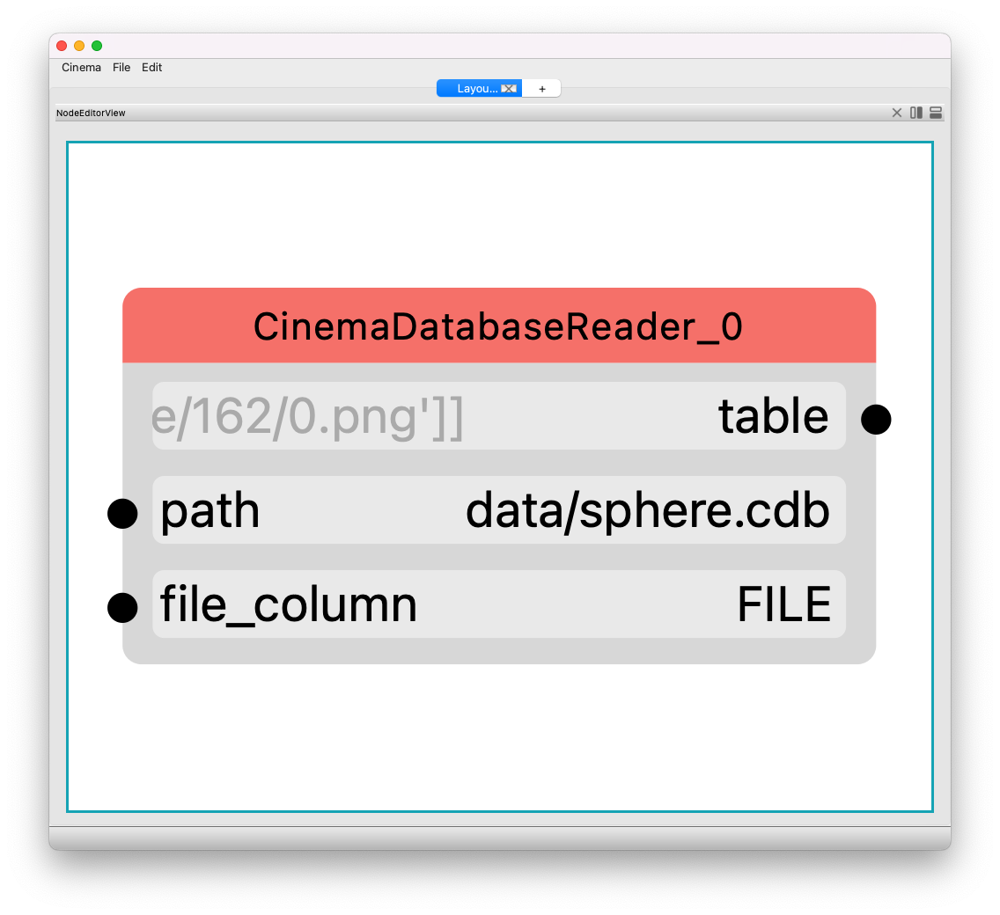

Building a Filter Graph
=======================

.. _building:

Building
--------

One of the most powerful capabilities of `pycinema` is support for building new filter graphs, specific to a task. It's easy to 
connect filters together, adjust views, and create visual layouts of information that help you look at complex data.

Components of a single filter UI
--------------------------------

Each filter will have places that can accept input (like a text box), and dots showing places that can be connected (either inputs or outputs. In this example, we see the inputs and outputs of a *CinemaDatabaseReader* filter:

- **table** is an output connection
- **path** is an attribute describing the path to the database
- **file_column** is an attribute describing the column in the Cinema database that contains the file path for the artifact.

.. code-block:: console

   cinema view data/sphere.cdb

.. image:: img/build_01.png
   :align: center

Building a simple filter graph
---

To get started, run the cinema application from the command line, and the `Cinema:Theater` application will open and you will see 
a blank window, which is the node layout window:

First, add a filter to read in some data. Click on the **Edit** menu item, and choose the **Add filter ...** item. The filter selection window will appear. Diuble clicking on a name in the scroll box will create a node in the canvas. 

.. image:: img/filter_menu.png
   :align: center

Connecting filters
------------------

Users can connect and disconnect filters directly in the node graph editor. 

.. image:: img/build_03.png
   :align: center

.. image:: img/build_04.png
   :align: center

.. image:: img/build_05.png
   :align: center

