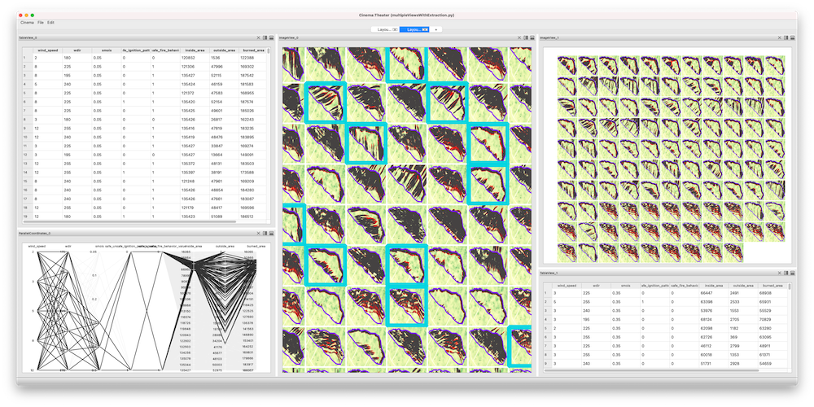
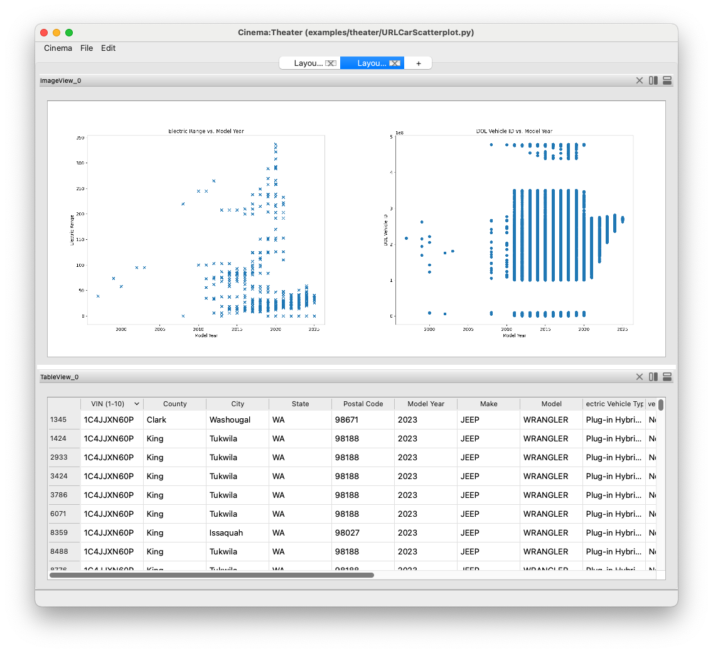

Examples
========

.. _examples:

This mult-view application was created to view typical image-based
cinema database. The application was then abstracted and added to the
``pycinema`` module as a native application that can run on any image-based
database:

A cinema database may describe a collection of metadata, without 
including any artifacts. In this case, the data can be loaded, filtered,
manipulated and displayed just like any other cinema database. In this
example, a ``csv`` file is loaded from the web, and displayed as a table
and in a pair of plots:

