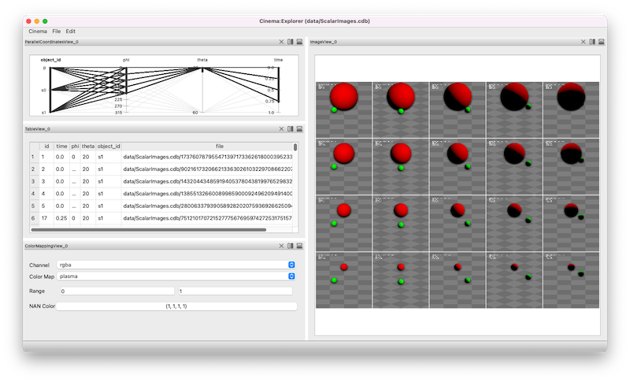

Cinema:Explorer workspace
=====

.. _explorer:

The **Cinema:Explorer** workspace provides a *parallel coordinates view*, a *table*, *rendering controls* and an image view. The image view adjusts to show all images that are selected in the *parallel coordinates view*.

.. image:: img/explorer-01.png
   :align: center

More text

.. image:: img/explorer-02.png
   :align: center

More text

