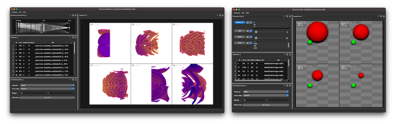

pycinema documentation
======================

   Screen capture of the Cinema:Explorer and Cinema:View scripts, running under a dark desktop theme. pycinema 
   introduces scripts, filters, state saving and interactive filer graph construction to the Cinema toolkit. 

**pycinema** is an open source toolkit for reading, manipulating and viewing `Cinema <https://cinemascience.github.io>`_ databases. The module includes the `cinema` command line tool, which can be used to run the `Cinema:Theater` application. Users can use `Cinema:Theater` to build *filter graphs* that use a library of operators to load, manipulate and view data in different ways. These *filter graphs* can be saved as scripts, or adapted to be *applications* that can run on any input data.

**pycinema** is a flexible, expandable toolset for working with data artifacts, especially Cinema databases. Users can easily construct and save scripts using a node graph constructor in *Cinema:Theater* to connect filters and views in customized configurations. Users can include bits of python to be executed, and can create new filters to add to the core capabilities of `pycinema`. 

Example Data
------------

You can download example data referenced in this documentation `here <https://github.com/cinemascience/pycinema-examples/archive/refs/tags/v3.1.0.zip>`_

Contents
--------

.. toctree::

   usage
   theater
   urlexample
   examples
   building
   linking
   shortcut
   environment
   applications
   scripts
   filters
   plugin
