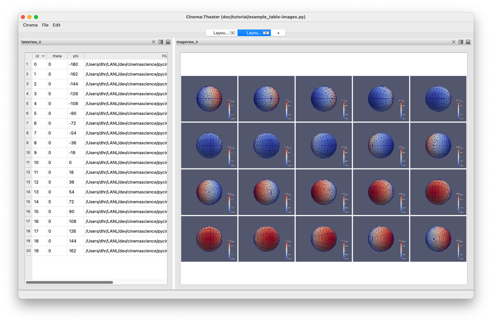
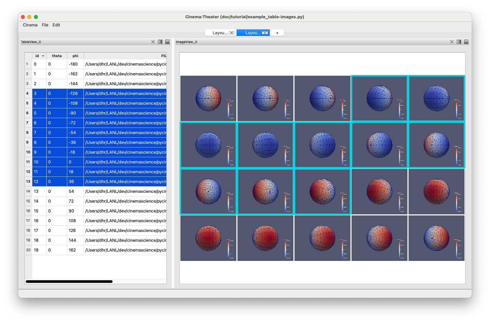
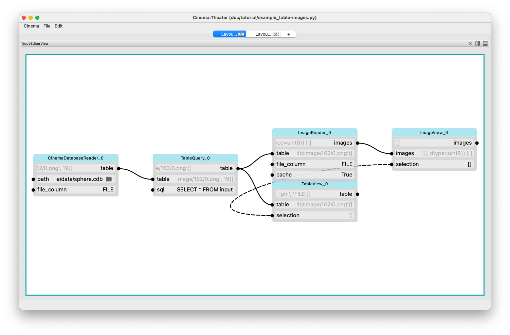
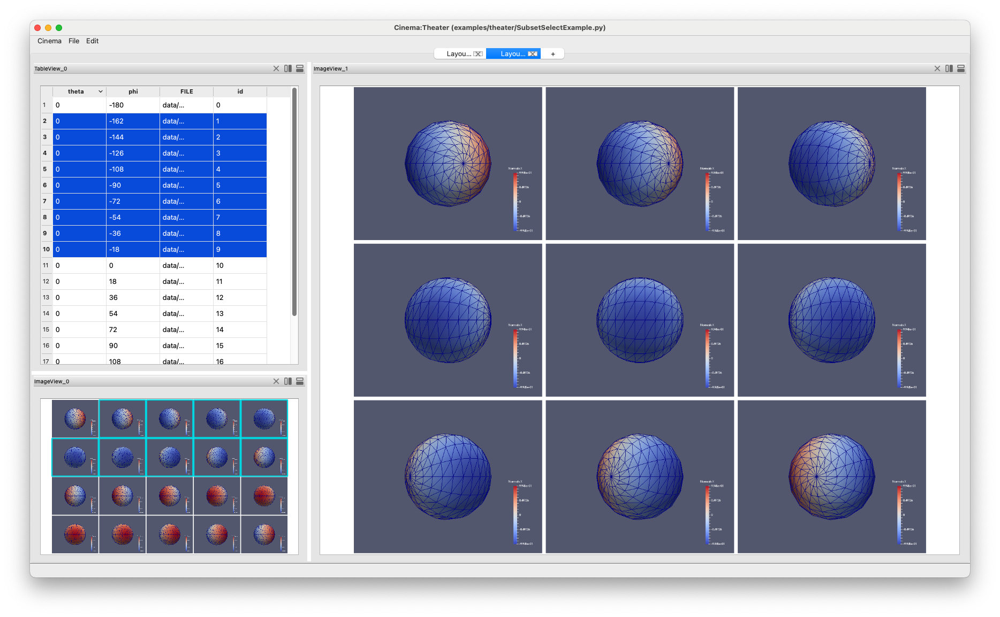
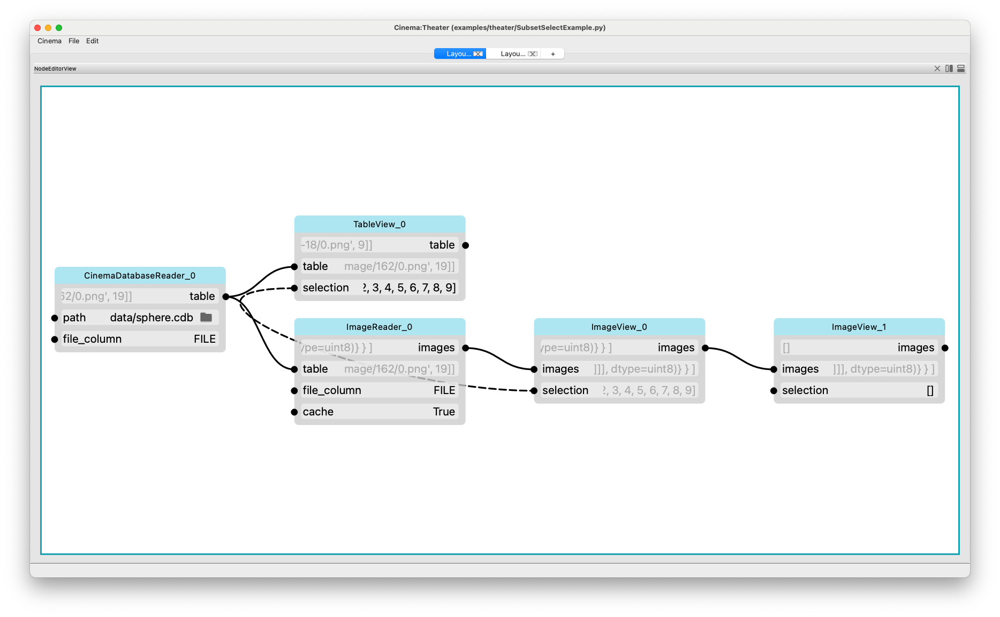

Linking Selection (Filters and Views)
=====================================

.. _linking:

It's often useful to link selection across views and filters, so that
the same data can be viewed in different ways. For example, in the screen capture below,
we see two views of a cinema database. On the left it is shown as a table, and on the
right as a set of images.

Linking the selection in these two views allows the user to explor both representations
of the database at the same time. A user can click and select in either view, and because
of the way the underlying node graph is connected, the selection will appear in both 
windows. This is shown in the screen capture below.

If we look at the Node Inspector view of the application, we can see that the input channel
named 'selection' in the TableView and ImageView are linked by a dotted line. This indicates
that the channels are linked, and that changes in the value of one will be reflected in the
other. This update happens both ways.

This link is created/deleted in the normal manner of using the mouse to select on endpoint,
and then drawing a line to the other channel.

Focusing on the Selected Items
------------------------------

Using the same mechanism, we can inspect just the selected set, by adding a view that
is linked to the output of the view showing the selection. This sends just the 
subset of selected images to the new view, allowing a focused view of the data.

The node inspector shows how this is accomplished: with the addition of a single view:

