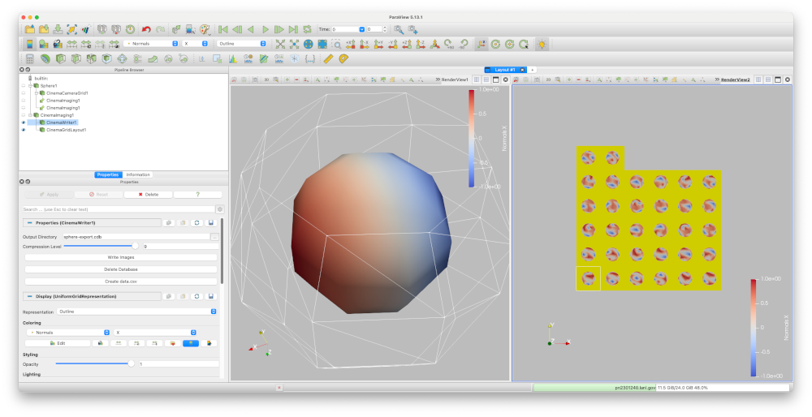
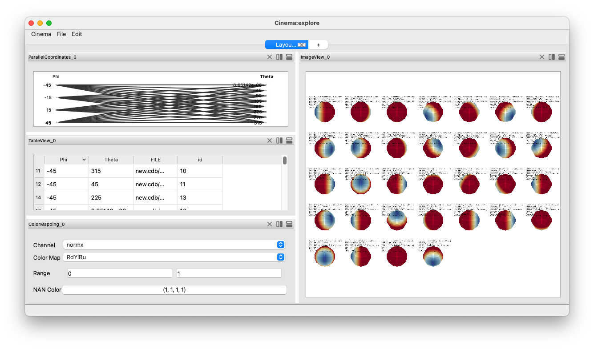

Exporting Cinema databases from ParaView
========================================

.. _plugin:

ParaView's 5.13 release included an advanced Cinema database exporter
that makes it easy to create cinema databases from any scientific dataset.

This example shows ParaView executing an export workflow, and displaying the
results of the export. We will go through this process in detail, but for now,
we show the overall ParaView application interface. Users can adjust the
variables exported, the density and placement of camera positions, and adjust
the overall visualization interactively in ParaView before exporting the image
database. It is exported in Cinema's HDF5 image format.

Once it is exported, we can use ``cinema explore``, to investigate the
database, and explore ways to recolor the images interactively.

