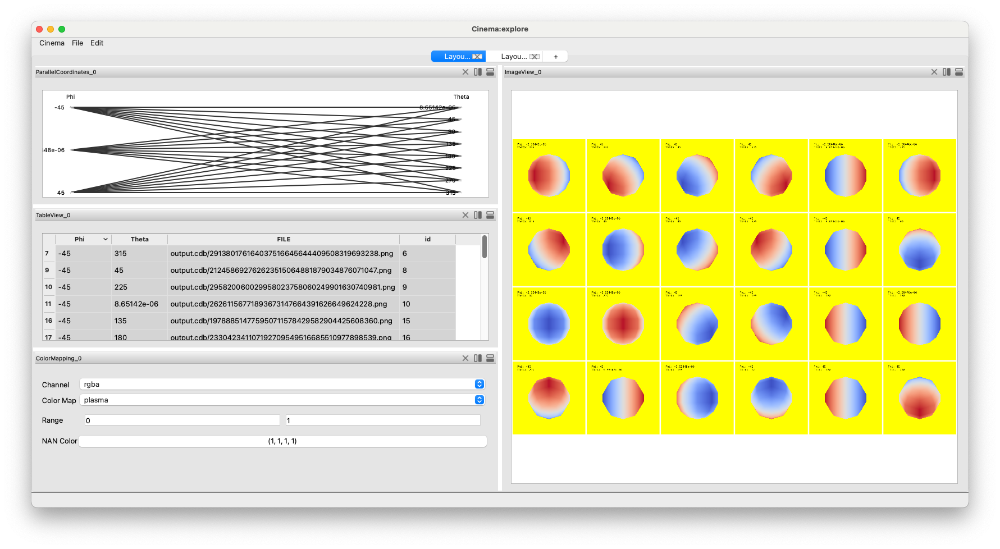

Exporting Cinema databases from ParaView
========================================

.. _plugin:

In this simple example, we have created a Cinema database export pipeline
using the ``Cinema Export`` plugin avaiable in ParaView 5.13 and later. We 
will go through this process in detail, but for now, we show the overall 
ParaView application interface. Users can adjust the variables exported, the
density and placement of camera positions, and adjust the overall visualization
interactively in ParaView before exporting the image database. It is exported
in Cinema's HDF5 image format.

.. image:: img/sphere-export.png
   :align: center

Next, we can load the database into ``cinema explore``, we can investigate the
database, and explore ways to recolor the images interactively.

