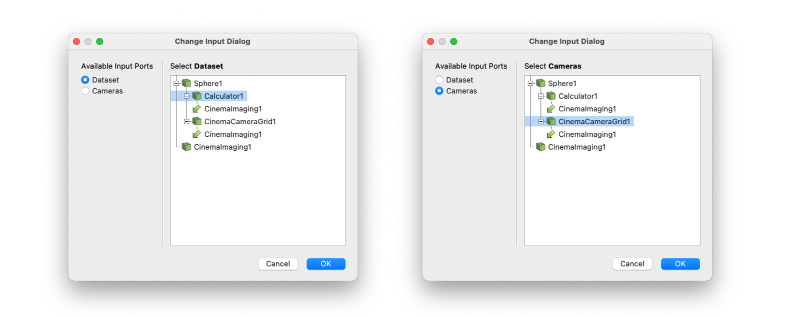
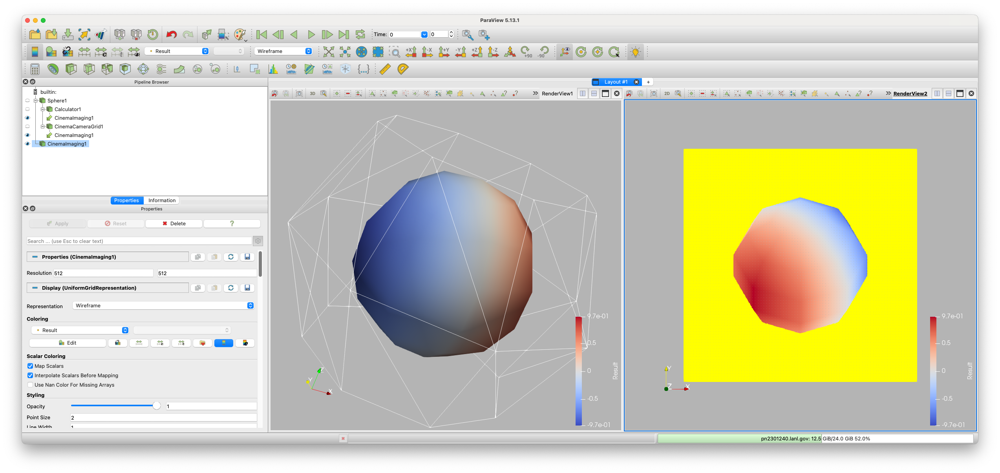
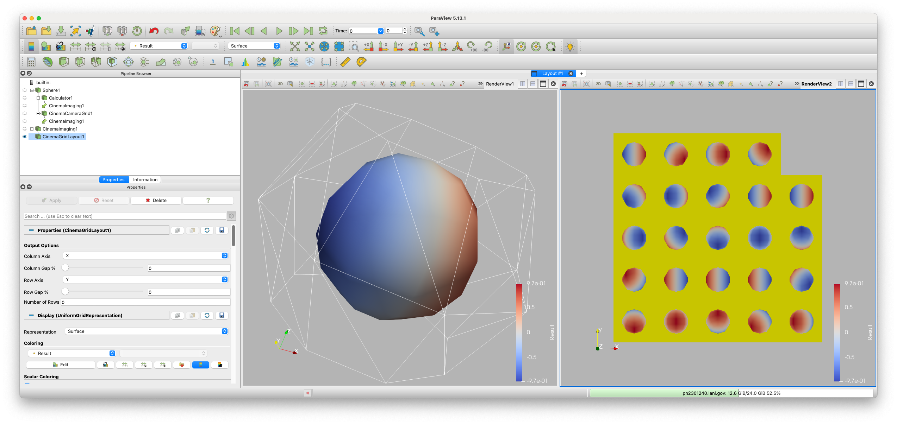

Exporting databases from ParaView
=================================

.. _plugin:

ParaView's 5.13 release included an advanced Cinema database exporter
that makes it easy to create cinema databases from any scientific dataset.

This plugin exports cinema databases in the HDF5 format, which saves images of
float values, instead of RGB images. These images can be composited and
recolored with the pycinema toolkit. (as shown in the **composite and recolor**
section).

The example below shows ParaView executing an export workflow, and displaying
the results of the export. We will go through this process in detail, but for
now, we show the overall ParaView application interface. Users can adjust the
variables exported, the density and placement of camera positions, and adjust
the overall visualization interactively in ParaView before exporting the image
database.

You can download the ParaView state file for this example 
here :download:`sphere.pvsm <_static/sphere.pvsm>`

Once it is exported, we can use ``cinema explore``, to investigate the
database, and explore ways to recolor the images interactively.

.. image:: img/sphere-explore.png
   :align: center

Loading the Cinema Export Module
--------------------------------

To make sure that the Cinema Plugin is loaded: From the menu, choose *Tools ->
Manage Plugins...*. Find the *CinemaExport* plugin and click the arrow at the
left side to open the pluging options. Select the plugin by clicking on the
name, then click the ``Auto Load`` button. Next, click the ``Load Selected``
button, then close the window.

The Cinema Export Plugin adds several filters to ParaView which help you
create, view and export Cinema databases.

- **Cinema Camera Grid** This creates geometry that determines the viewpoints
  in a cinema database. 

- **Cinema Grid Layout** This lays out the images from a Cinema Imaging filter
  in a ParaView window.

- **Cinema Image Compositing** This allows compositing of Cinema images with
  multiple elements. 

- **Cinema Imaging** This generates the images of a dataset using the *Cinema
  Camera Grid*.

- **Cinema Writer** This writes out the images and *data.csv* file for a Cinema
  database.

How to Assemble a Cinema Export pipeline in ParaView
----------------------------------------------------

Now let's use these filters to export a cinema database from ParaView: 

- Create a sphere source.

- Connect a calculator to the sphere source. Choose 'Normals_X' from the *Scalars* 
  pulldown, and change the *Result Array Type* to *Float*.

- Select the *Sphere* and add a *Cinema Camera Grid* filter.
 
- Add a *CinemaImaging* filter and set the *Calculator* as *Dataset input*,
  and *CinemaCameraGrid* as *Cameras input*. Do this by clicking on the radio
  buttons on the left side of the *Change Input Dialog* and selecting the
  correct filter from the pipeline on the right side of the Dialog.

- Click on the eye icons next to the *Calculator* filter and the *CinemaCameraGrid* 
  filter so that those are the only things showing in the current render view.

- Split the screen, create another *RenderView* and click on the eye icon next
  to the *CinemaImaging* filter so that it is shown in the second view. In the
  *CinemaImaging* filter properties under **Coloring**, select *Result* for
  the variable to be shown (see below)/

- Select the *CinemaImaging* filter, and add a *CinemaImageGridLayout* filter
  to it. Then select the second render view by clicking in the window, and then
  click the ``Zoom to Data`` button to show all the images (see below).

- To write this database to disk, select the *CinemaImaging* filter and add a
  *CinemaWriter* filter. Type a valid path *ending in .cdb* in the *Output
  Directory* text box, then click the ``Apply`` button. This will write images to
  the output directory. Then click the ``Create data.csv`` button. This will
  write out the ``data.csv`` file in the Cinema database directory.
