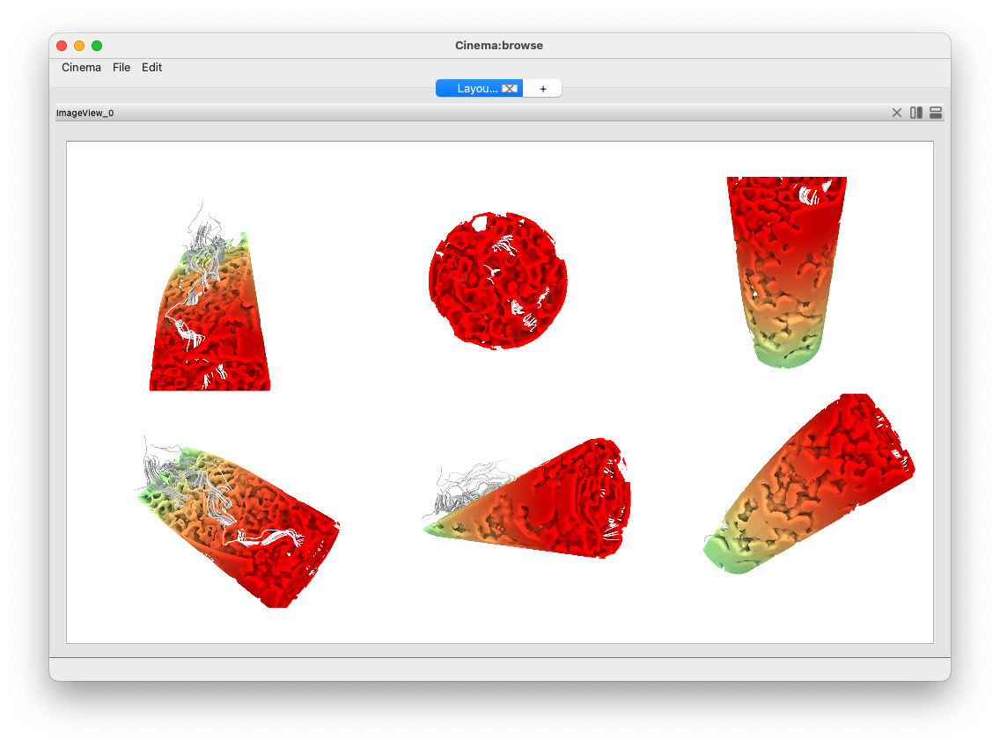

Running Cinema scripts
======================

The `cinema` command line tool makes a host of pycinema capability available through the
command line. The `cinema` help message shows the list of subcommands available, and a
short description of their capabilities:

.. code-block:: console

   $ cinema --help 

   usage: cinema [-h] {compose,meta,browse,discover,explore,imagegrid,view,theater} ...

   Cinema command line tool

   positional arguments:
     {compose,meta,browse,discover,explore,imagegrid,view,theater}
                           Sub-commands
       compose             convert Cinema float (hdf5) images to .png
       meta                dump descriptive metadata about a cinema database
       browse              browse a cinema database
       discover            discover a cinema database
       explore             explore a cinema database
       imagegrid           imagegrid a cinema database
       view                view a cinema database
       theater             run a cinema script in theater

    options:
      -h, --help            show this help message and exit

The `cinema` command line tool runs pycinema-created python scripts using the `pycinema`
module. These scripts can be run from the command line by providing the path to
the script as a single command line argument.

This example script loads a Cinema database, queries for a single image, then
applies an image border to that image. Both the original and the image with the
border are displayed side-by-side.

.. code-block:: console

   $ cinema examples/theater/ImageBorder.py 

.. image:: img/script-imageborder.png
   :align: center

This example script loads a Cinema database, queries for a single image, then
applies an image edge detection algorithm to that image. The result of that
edge detection is then composited onto the original image using a mask
composite operation.

.. code-block:: console

   $ cinema examples/theater/ImageEdgeDetection.py 

Scripts with No GUI
------------------------------

Some `pycinema` scripts do not not include GUI elements, and can be run
with `python`, assuming that the `pycinema` module has been installed. 
These scripts execute `pycinema` scripts, producing intermediate data 
products, files, etc. as defined by the filters.

For example, the following script reads in a Cinema database, then writes out the
`data.csv` file as a new csv file, without requiring the GUI:

.. code-block:: console

   $ python examples/python/TableWriteExample.py

Compositing HDF5 images
-----------------------

Cinema defines an image format that can be recolored and comoposited
interactively, providing users with a way of changing and exploring the images
after they have been created. For example, the following screen capture shows
the results of compositing the elements in the `GroundWater.cdb` database
(available `here <https://github.com/cinemascience/pycinema-data>`_) using a
different colormap for one of the elements (rainbow on the left, and greens on
the right).

Using the `GroundWater.cdb` database and basic settings, we can
composite images consisting of two elements - a pourous rock, and streamlines
showing the flow of water within the rock. Each element is colored by a
different colormap (the streamlines are gray, and the rock is rainbow):

.. code-block:: console

    config:
      depthchannel: Depth
      output: GroundWater_composited_noshadows.cdb

    database:
      path: pycinema-data/GroundWater.cdb
      filecolumn: FILE
      elementlabel: object_id

    elements:
      - name: '0'
        channel: Elevation
        channelrange: [-1.0, 1.0]
        colormap: rainbow
        nancolor: [0, 0, 0, 0]
      - name: '1'
        channel: Elevation
        channelrange: [-1.0, 1.0]
        colormap: gray
        nancolor: [0, 0, 0, 0]

These images can be improved by activating ambient occlusion shadows and
providing values in the configuration file. The configuration file below
produced the following results:

.. code-block:: console

    config:
      depthchannel: Depth
      output: GroundWater_composited_noshadows.cdb

    database:
      path: pycinema-data/GroundWater.cdb
      filecolumn: FILE
      elementlabel: object_id

    elements:
      - name: '0'
        channel: Elevation
        channelrange: [-1.0, 1.0]
        colormap: rainbow
        nancolor: [0, 0, 0, 0]
      - name: '1'
        channel: Elevation
        channelrange: [-1.0, 1.0]
        colormap: gray
        nancolor: [0, 0, 0, 0]

    shadow:
      state: True
      type: SSAO
      radius: 0.03
      samples: 32
      diff: 0.5

