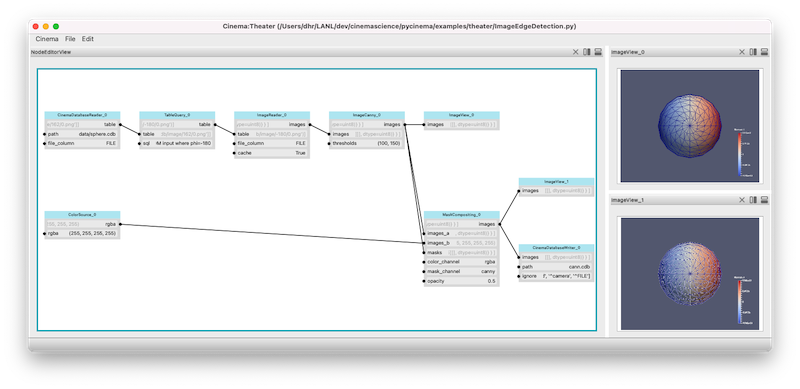

Cinema Theater 
==============

The `Cinema:Theater` application is used to create, modify and save new filter/view combinations. Users can start from scratch and build filter graphs, open existing cinema databases, or open existing scripts. These can then be modified and saved. To start using `Cinema:Theater`, run the `cinema` tool from the command line with no arguments:

.. code-block:: console

   cinema

The application will start, and the user will see a blank view. New filter graphs can now be built using the following steps:

- Add individual filters through the `Edit->Add filter ...` menu item.  
- Load an existing script with `File->Load script ...`
- Open an existing Cinema database with `File->Open Cinema database ...`

Loading the `ImageEdgeDetection.py` script from the examples results in the following configuration:

   Screen capture of the example ImageEdgeDetection.py script running in Cinema:Theater. 
