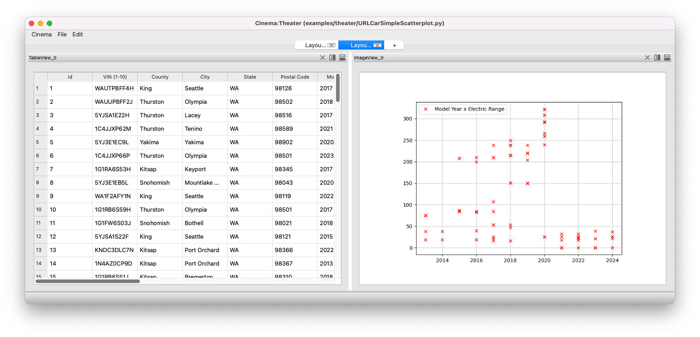
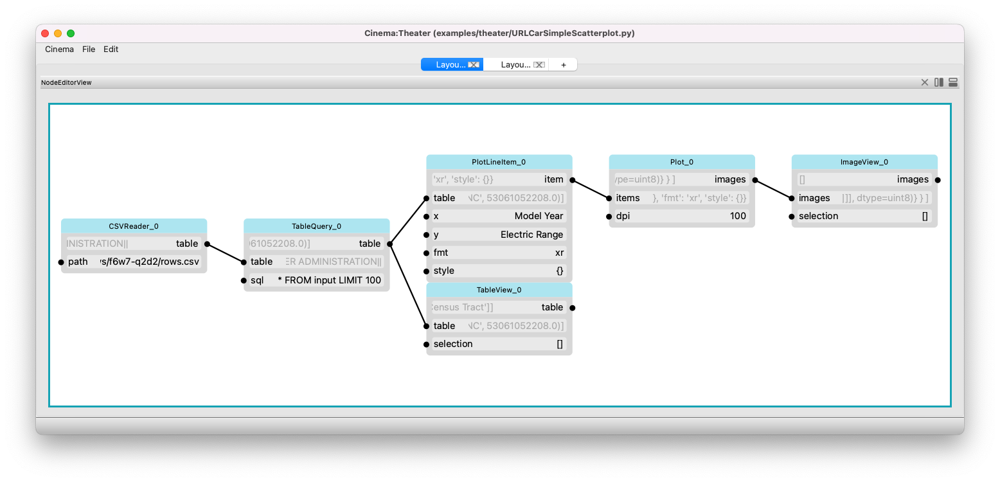

Components of an application
=============================

.. _windows:

Windows in an Application
-------------------------

The example script `URLCarScatterplot.py` shows the main components of the `Cinema:Theater` application.
When the application first comes up, the top bar, just under the file menu, we see that there are two tabs
in the application. The tab that is showing consists of a split screen with two views of data. On the left, 
a table shows the input data, and on the right that data is shown in a plot.

The other tab shows the node graph that powers the two views.

This muti-tab, split view application provides access to both a clearly presented set of data views, and the 
powerful filter graph underlying the application.
