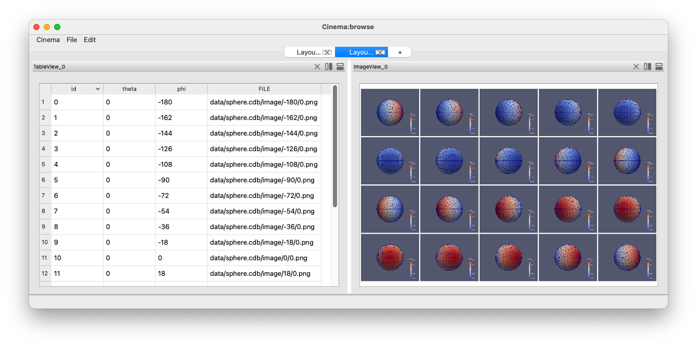
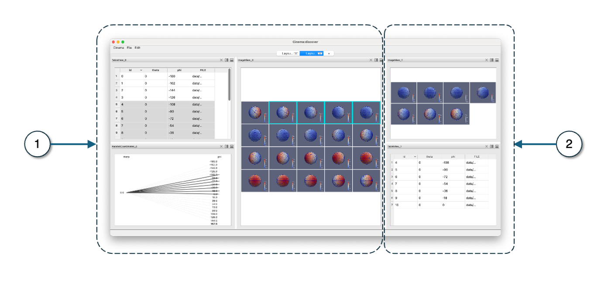

Using pycinema
==============

.. _installation:

Installation
------------

To use `pycinema`, first install it using pip:

.. code-block:: console

   $ pip install pycinema 

This will install the pycinema module, which includes both the filter library and the `cinema` command line tool.
The `pycinema` module will be available in normal python scripts, and the `cinema` command line tool will be
available in your shells. 

Running cinema applications
---------------------------

Download the `example data repository. <https://github.com/cinemascience/pycinema-examples/archive/refs/tags/v3.1.0.zip>`_

.. code-block:: console

   cinema view data/sphere.cdb

The ``cinema`` command line tool can view databases using a set of *applications* which can be called from the command
line. See below for examples of these applications.

.. image:: img/cinema-view-sphere.png
   :align: center

.. code-block:: console

   cinema explore data/sphere.cdb

Likewise, the `explore` application can be used to view the sample database, using a 
parallel coordinates widget to help inspect the data:

.. image:: img/cinema-explorer-sphere.png
   :align: center

.. code-block:: console

   cinema browse data/sphere.cdb

The `browse` application creates a linked table and image view:

.. code-block:: console

   cinema discover data/sphere.cdb

The `discover` application creates a focus-plus-context view of the dataset, with 
view of the entire dataset (1), and a linked view of the selected data (2).

