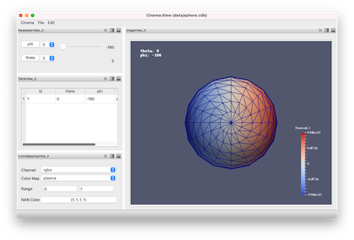
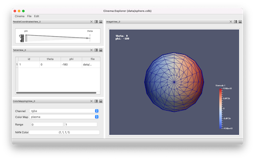

Usage
=====

.. _installation:

Installation
------------

To use `pycinema`, first install it using pip:

.. code-block:: console

   $ pip install pycinema 

This will install the pycinema module, which includes both the filter library and the `cinema` command line tool.
The `pycinema` module will be available in normal python scripts, and the `cinema` command line tool will be
available in your shells. 

Getting Started
---------------

Download the `example data repository. <https://github.com/cinemascience/pycinema-examples/archive/refs/tags/v3.0.zip>`_

The `cinema` command line tool can view databases using a set of `application` released with the module. Currently, there are `view` and `explore` application, and they are called on specific databases in the following way:

.. code-block:: console

   cinema view data/sphere.cdb

Likewise, the `explore` application can be used to view the sample database:

.. code-block:: console

   cinema explore data/sphere.cdb

The main difference between the two application is that `explore` uses a parallel coordinates widget to explore metadata, while the `view` application uses a set of sliders.

