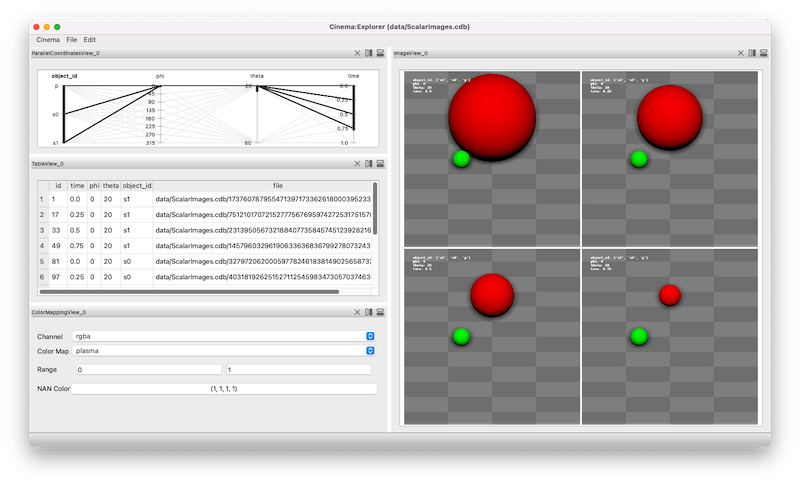

Cinema:View workspace
=====

.. _view:

The **Cinema:View** workspace provides a *parallel coordinates view*, a *table*, *rendering controls* and an image view. The image view adjusts to show all images that are selected in the *parallel coordinates view*. Brushing and selecting on the the *parallel coordinates view* selects images that are then displayed in the image view. In this example, three objects are composited into a single image.

.. image:: img/explorer-01.png
   :align: center

Selecting four timesteps (the rightmost axis) results in four images being displayed.

Finally, selecting five `phi` values results in twenty images (4X5) being displayed.

.. image:: img/explorer-03.png
   :align: center

