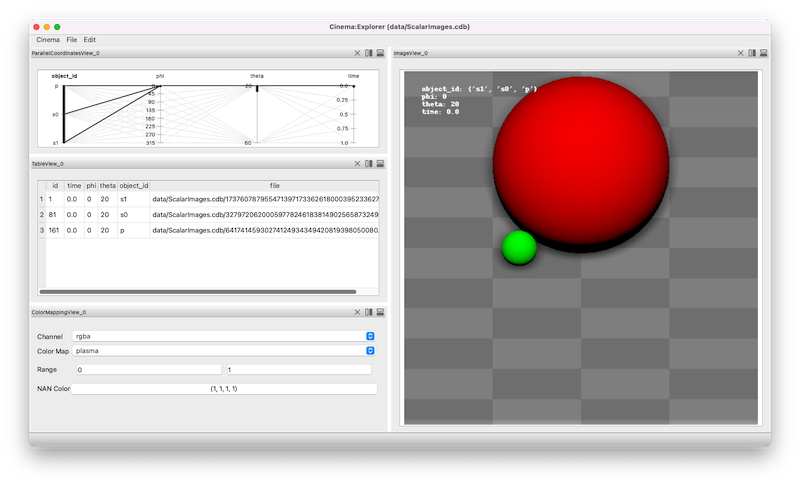

Cinema Workspaces
=================

.. _explorer:

The `Cinema:Theater` application introduces the concept of `workspaces` to Cinema. A `workspace` is a defined set of filters and views that can be used to view some collection of data. Several `workspaces` are defined in the module, and can be used from either the command line or the `Cinema:Theater` application.

Cinema:Explorer workspace
-------------------------

The **Cinema:Explorer** workspace provides a *parallel coordinates view*, a *table*, *rendering controls* and an image view. The image view adjusts to show all images that are selected in the *parallel coordinates view*. Brushing and selecting on the the *parallel coordinates view* selects images that are then displayed in the image view. 

In this example, three objects are composited into a single image. These elements (a red sphere, a green sphere and a checkered background) are selected in the leftmost axis. Note the three entries in the table view, showing the metadata for these three objects at a single phi, theta and time.

Selecting four timesteps (the rightmost axis) results in four images being displayed, and the table view of the selected components being updated.

.. image:: img/explorer-02.png
   :align: center

Finally, selecting five `phi` values results in twenty images (4X5) being displayed, and the table view of the selected components being updated.

.. image:: img/explorer-03.png
   :align: center

Cinema:View workspace
---------------------

The **Cinema:View** workspace provides a *parameter slider view*, a *table*, *rendering controls* and an image view. 

.. image:: img/view-01.png
   :align: center

Selecting four timesteps (the rightmost axis) results in four images being displayed, and the table view of the selected components being updated.

.. image:: img/view-02.png
   :align: center

Finally, selecting five `phi` values results in twenty images (4X5) being displayed, and the table view of the selected components being updated.

.. image:: img/view-03.png
   :align: center
